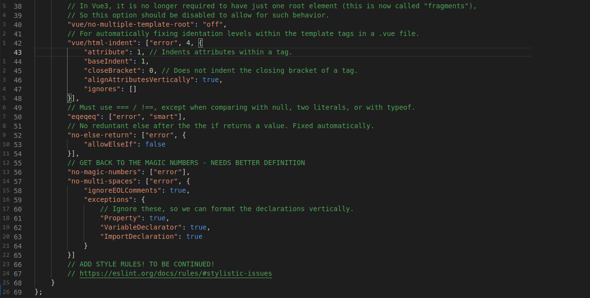

# Frontend


## Project setup
```
npm install
```

### Compiles and hot-reloads for development
```
npm run serve
```

### Compiles and minifies for production
```
npm run build
```

### Run linter with --fix flag set
```
npm run lint
```

### Some custom linter configuration details:
